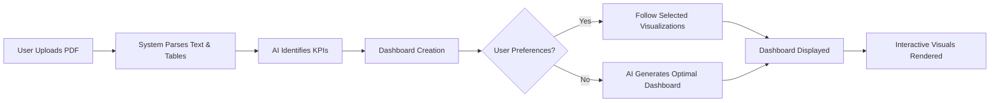

# AI-Powered Automated Data Analytics Website

## 🎯 Project Objective

This project aims to develop a fully automated data analytics website that can:
- **Read PDF files** and extract Key Performance Indicators (KPIs)
- **Generate dashboards** based on extracted KPIs
- **Support both guided and automated** dashboard creation
- **Provide simplicity and automation** for non-technical users

## 📋 Requirements & Specifications

### Input Processing
- Upload and parse PDF files (text, tables, numerical data)

### KPI Extraction
- AI models detect and extract KPIs:
  - Sales figures
  - Revenue metrics
  - Expense data
  - Growth rates

### Dashboard Generation
- **Automatic dashboard creation** with charts, graphs, and KPIs
- **Two modes**:
  - Manual: User-defined preferences
  - Automated: AI-generated optimal visualizations

### Visualization Types
- Bar charts
- Line graphs
- Pie charts
- KPI cards
- Heatmaps
- Trend lines

### User Interaction
- Simple interface for:
  - File uploads
  - Dashboard type selection
  - Automatic generation option

### Scalability
- Future support for multiple formats:
  - Word documents
  - Excel spreadsheets
  - CSV files

### File Handling & Security
- Secure file storage with encryption

## 🚀 Why It's Needed / Benefits

| Benefit | Description |
|---------|-------------|
| **Automation** | Converts static PDFs into actionable dashboards without manual effort |
| **Speed** | Delivers instant insights from reports |
| **Accessibility** | Helps non-analysts interpret data through visualizations |
| **Customization** | Provides flexibility with user-defined dashboard preferences |
| **Efficiency** | Saves time by reducing repetitive manual reporting |

## 🛠️ Tools & Technologies Required

### Frontend Options
1. **Streamlit** - Rapid prototyping with ready-made UI components
2. **HTML/CSS/JavaScript** - Custom web interface

### Backend & Processing
- **Python** for data parsing and KPI extraction

### AI/ML Components
- **NLP Models**: HuggingFace Transformers, OpenAI API, or LLMs
- **PDF Processing**: PyMuPDF, PDFplumber, or Camelot (for structured tables)
- **Data Handling**: Pandas and NumPy
- **Visualization**: Plotly, Matplotlib, or Streamlit-native charts

### Database
- **SQLite** or **PostgreSQL** (with Docker)
- **Encryption** for secure storage

## 🔄 How It Works

### Process Flow
1. **User Uploads PDF** → System parses content
2. **AI Identifies KPIs** → Relevant metrics extracted
3. **Dashboard Creation**:
   - If user specifies preferences → follows selected visualizations
   - If not → AI generates most suitable dashboard automatically
4. **Dashboard Displayed** → Interactive visuals rendered on site

